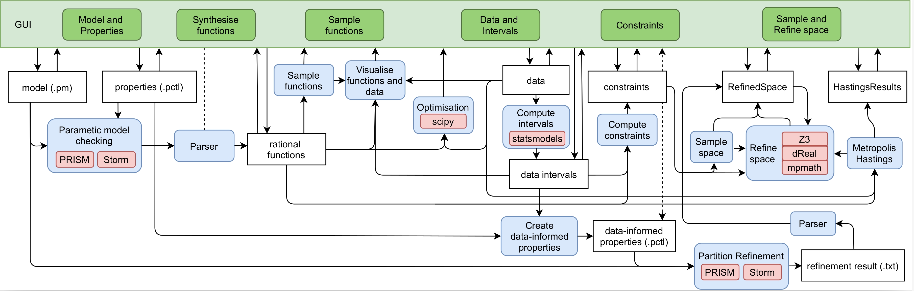

# DiPS Data-informed Parameter Synthesiser

## A Tool for Data-informed Parameter Synthesis for Discrete-Time Stochastic Processes from Multiple-Property Specifications

DiPS is a tool for parameter synthesis for discrete time Markov chains (DTMCs) against multiple-property specifications provided in Probabilistic Computation Tree Logic (PCTL). 
The probability of satisfaction of each property is constrained by intervals obtained from data. 
For a single property, the existing parameter synthesis tools can compute a rational function over the chain’s parameters, which will evaluate exactly to the satisfaction probability for that single property in the given chain.
DiPS first computes these rational functions for each among the multiple properties by invoking the existing parameter synthesis tools [PRISM](http://www.prismmodelchecker.org) and [Storm](http://www.stormchecker.org/). 

Further, data measurements serve as an experimental estimation of the probability of satisfaction of PCTL formulae.
With intervals derived from the data, DiPS allows to further constrain the rational functions.

Finally, by coupling the obtained rational functions and interval constraints, DiPS implements four distinct methods for exploring which parameters of the
chain are compliant with the data measurements:

 * space refinement - CEGAR like method splitting the parameter space. In each iteration, the result is provided by:
    * SMT solver - [Z3](https://github.com/Z3Prover/z3) or [dreal](http://dreal.github.io/)
    * interval arithmetic - [scipy](https://www.scipy.org/)
* space sampling - checking satisfaction of constraints in sampled points, 
* optimisation - searching for least violating parameter point, 
* Bayesian inference (Metropolis-Hastings) - searching for most probable parameter points.

The tool was primarily designed to facilitate flexible and efficient parameter search for stochastic models in computational systems biology, where scarcely available data measurements (e.g. only at the steady-state) can be naturally encoded as multiple-property specifications.
However, the tool is directly applicable to any search problem, where multiple functions over unknown real variables are constrained by real-valued intervals.

A scheme showing tool components and communication among them:

For more information, please read [How to use section](#HOW-TO-USE).
Feel free to leave response either via issues or an email.
*****
## HOW TO INSTALL

The tool was developed and optimised for Win10 and Ubuntu. The tool may not function properly on different operating systems.

### 1. INSTALL DEPENDENCIES:

* [Python](https://www.python.org/) 3.7
    * Windows - just python
    * Ubuntu/Debian - Python header files should also be installed, please use `sudo apt install python3-dev`
    * Fedora/CentOS - Python header files should also be installed, please use `sudo dnf install python3-devel`
* [PRISM](http://www.prismmodelchecker.org) 4.4 or 4.5
* install tkinter library 
  * Windows - already done
  * otherwise go [here](https://tkdocs.com/tutorial/install.html) 
* other missing python packages 
  * in the main directory `MyDiPS` run `pip3 install -v .`
* (Unix, Mac) - install dreal (optional)
  * `pip3 install dreal`
  * build dreal - info [here](https://github.com/dreal/dreal4#how-to-build)
* [Storm](http://www.stormchecker.org/) (optional, advanced) 
* [Prophesy](https://moves.rwth-aachen.de/research/tools/prophesy/) (optional, advanced)

Are you having trouble with z3? Read `MyDiPS\README-z3.md`. Still having trouble? Please contact us.

****
### 2. SETUP CONFIG (OPTIONAL)

In the main folder, there is `config.ini` file. Please fill 'prism_path' to use PRISM. Further items are optional. You can use them to navigate to I/O folders or change default settings of DiPS.   

[mandatory_paths]
* `prism_path`: path to PRISM `PRISM\bin\`
* `cwd`: path to the main folder `MyDiPS`

[paths]
* `models`: path to [PRISM models](http://www.prismmodelchecker.org/tutorial/die.php) eg. `MyDiPS/models`
* `properties`: path to [PRISM properties](https://www.prismmodelchecker.org/manual/PropertySpecification/Introduction) eg. `MyDiPS/properties`
* `data`: path to data eg. `MyDiPS/data`
* `results`: path to save results (all the results are saved in the subfolders) eg. `MyDiPS/results`
* `tmp`: path to save temporal/intermidiate files  eg. `MyDiPS/tmp`

[settings]
* `refine_timeout`: refinement timeout
* `mh_timeout`: = Metropolis-Hastings timeout

*****
## HOW TO RUN

*****
Now you can import the source code as a library or run the tool with GUI.

### Tool
\- open command line in the main DiPS directory (on Win - please open it with admin privileges to ensure changing the PRISM setting does not fail on permission denied)

`>> cd src`

`>> python gui.py`

Graphical User Interface should appear now (With some additional output returned in the command line). 

For fully functional GUI (all the features fully visible) please set the scale of the screen to 100%.

*****
## HOW TO USE

*****
For a brief summary, you can see our poster (CMSB 19), `cmsb_poster.pdf`.

To follow the main workflow of the tool using the graphical user interface, please see `tutorial.pdf`.

For more information about the methods, please follow the tool paper (submitted) or previous HSB paper [[1]](#one) (if not reachable, please write us an email.)

*****
## HOW TO CITE US

[1] Hajnal, M., Nouvian, M., Šafránek, D., Petrov, T.: Data-informed parameter synthesis for population Markov chains. In: Češka, M., Paoletti, N. (eds.) Hybrid Systems Biology. pp. 147-164. Springer International Publishing, Cham (2019)

*****
## ACKNOWLEDGMENT

I want to thank the following people who helped me with the code issues:
* [Michal Ovčiarik](https://github.com/bargulg)
* [Nhat-Huy Phung](https://github.com/huypn12)
* [Denis Repin](https://github.com/dennerepin)

and I want to thank the following people for user testing and feedback:
* [Nhat-Huy Phung](https://github.com/huypn12)
* [Denis Repin](https://github.com/dennerepin)
* [Samuel Pastva](https://github.com/daemontus)
* [Stefano Tognazzi](https://github.com/stefanotognazzi)
* Morgane Nouvian
* [Matej Troják](https://github.com/xtrojak)

This project has been supported by the [Centre for the Advanced Study of Collective Behaviour](https://www.exc.uni-konstanz.de/collective-behaviour/), Young Scholar
Fund (YSF), project no. P83943018F P430 /18, and Max Planck Institute of Animal Behaviour.
